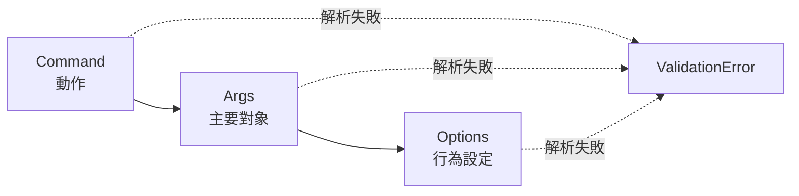

# HTML SVG Flow Diagrams

Use this only when an article has a process, boundary, decision, or state change that becomes clearer as a small figure. Diagrams should support the prose structure chosen by `to-html`; they should not turn the article into a diagram gallery.

## Shared Rules

- Keep diagrams self-contained in the final article: inline `<svg>`, local CSS, no Mermaid source, no screenshots, no remote assets, and no runtime diagram library.
- Use Mermaid as the default authoring format for flow, decision, state, boundary, and relationship diagrams. Render Mermaid to SVG during the skill run, sanitize/post-process the SVG, inline it into the HTML, and delete all intermediate `.mmd` and `.svg` files.
- Do not add Mermaid or `@mermaid-js/mermaid-cli` to the project root dependencies. The renderer is a skill/tooling dependency only.
- Place a diagram after the prose that introduces the concept, before detailed examples or checklists that depend on it.
- Use one diagram for one idea. Split large processes instead of making one dense SVG.
- Match `DESIGN-SYSTEM.md`: reuse article tokens, restrained color, readable type, and the same content width as tables and code blocks.
- During the `IMPROVE-HTML-ARTICLE.md` pass, remove any diagram that duplicates a nearby list, table, or paragraph without clarifying relationships.

## Diagram Selector

| Diagram | Use For | Keep Visible |
| --- | --- | --- |
| Linear flow | Ordered processing, parser/runtime pipelines, request flow | 3-5 nodes, directional arrows, one caption takeaway |
| Decision flow | A repeatable choice with clear outcomes | One question, 2-3 outcomes, branch labels |
| Boundary flow | Responsibility splits, error domains, layer ownership | Labeled regions, crossing point, owner of each side |
| State flow | Modes, lifecycle stages, status transitions | States, transition labels, terminal or reset state |
| Layered flow | Stack-like concepts or abstraction levels | Horizontal bands, concrete examples inside each band |

Prefer a table when the content is primarily comparison. Prefer an ordered list when sequence is obvious and no spatial relationship is being taught.

## Article Integration

1. Draft the article first.
2. Identify one place where a reader would benefit from seeing direction, branching, or ownership.
3. Write Mermaid source in memory or a temporary file. Keep labels short and use the article's primary language.
4. Render Mermaid to SVG using `scripts/render-mermaid-svg.mjs`.
5. Inline the sanitized SVG inside `<figure class="flow-figure">` with an optional `<figcaption>`.
6. Delete temporary Mermaid and SVG files. Do not keep diagram source in the repository unless explicitly requested.
7. Add only the CSS classes the figure uses.
8. Re-run the article's visual-system pass so the figure aligns with tables, callouts, and code blocks.
9. Run code highlighting after diagram edits, as usual for `to-html`; do not let highlighting rewrite SVG markup.

## Mermaid Rendering

Use Mermaid for the diagram source, then render it before delivery. The final HTML must contain only sanitized inline SVG.

Example source:



Render through the skill script:

```sh
cat <<'EOF' | bun .agents/skills/to-html/scripts/render-mermaid-svg.mjs \
  --title "CLI 輸入責任分界" \
  --desc "Command、Args、Options 與 ValidationError 的責任邊界。" \
  --caption "先分清動作、對象、設定，再判斷錯誤屬於 parser 還是 domain。" \
  --figure
flowchart LR
  Command["Command<br/>動作"] --> Args["Args<br/>主要對象"]
  Args --> Options["Options<br/>行為設定"]
  Command -. "解析失敗" .-> ValidationError["ValidationError"]
  Args -. "解析失敗" .-> ValidationError
  Options -. "解析失敗" .-> ValidationError
EOF
```

The script writes sanitized SVG or figure HTML to stdout unless `--out <file>` is provided. Prefer stdout for temporary use so no intermediate files remain in the repository.

Renderer resolution:

1. If `MERMAID_CLI_BIN` is set, the script uses that `mmdc` binary.
2. Otherwise it invokes `bunx --package @mermaid-js/mermaid-cli mmdc`.

This keeps Mermaid out of the current project's runtime and package manifest.

## SVG Requirements

- Include `viewBox`, `role="img"`, `<title>`, `<desc>`, and `aria-labelledby`. The render script adds or normalizes these.
- Use unique IDs for each diagram's title, description, marker, and clip/mask definitions. The render script prefixes SVG IDs.
- Use real SVG primitives in the final SVG. Mermaid output is acceptable after sanitization.
- Give every node a short label. Give non-obvious arrows or branches a short label.
- Do not rely on color alone. Shape, position, and text must carry the meaning.
- Keep the SVG responsive with `width: 100%; height: auto;`.
- The final SVG must not contain `<script>`, remote URLs, external fonts, or runtime Mermaid data.

## CSS Hooks

Use these class names unless the article already has equivalent figure styles:

```css
.flow-figure {
  margin: var(--space-xl, 24px) 0;
}

.flow-figure svg {
  display: block;
  width: 100%;
  height: auto;
}

.flow-node rect,
.flow-node path {
  fill: var(--white, #fff);
  stroke: var(--oat, #e3dacc);
  stroke-width: 1.5;
}

.flow-label,
.flow-node text {
  fill: var(--slate, #141413);
  font-family: ui-sans-serif, system-ui, -apple-system, BlinkMacSystemFont, "Segoe UI", sans-serif;
  font-size: 14px;
  font-weight: 650;
}

.flow-note {
  fill: var(--gray-700, #3d3d3a);
  font-size: 12px;
  font-weight: 500;
}

.flow-arrow {
  stroke: var(--clay, #d97757);
  stroke-width: 2;
  fill: none;
}
```

## Text Fit

Mermaid improves layout compared with hand-authored SVG, but text can still overflow or produce cramped diagrams.

- Keep labels to one or two short lines.
- Prefer `<br/>` in Mermaid labels when a label needs two lines.
- Split dense diagrams into multiple figures rather than forcing small text.
- Prefer short nouns and verbs over explanatory sentences inside nodes.
- Check the rendered SVG on mobile width before finishing.

## Fallback Inline SVG Pattern

Use hand-authored SVG only for very small diagrams or when Mermaid rendering is unavailable. Keep the same final requirements: accessible inline SVG, responsive sizing, no runtime dependency, and no remote assets.

Use this as a structure, not as fixed content:

```html
<figure class="flow-figure">
  <svg role="img" aria-labelledby="flow-title flow-desc" viewBox="0 0 760 170">
    <title id="flow-title">Short diagram title</title>
    <desc id="flow-desc">One sentence describing the process and main takeaway.</desc>
    <defs>
      <marker id="flow-arrowhead" viewBox="0 0 10 10" refX="8" refY="5" markerWidth="7" markerHeight="7" orient="auto-start-reverse">
        <path d="M 0 0 L 10 5 L 0 10 z" fill="var(--clay, #d97757)"></path>
      </marker>
    </defs>

    <g class="flow-node">
      <rect x="24" y="42" width="160" height="72" rx="8"></rect>
      <text x="104" y="75" text-anchor="middle">First step</text>
      <text class="flow-note" x="104" y="96" text-anchor="middle">short note</text>
    </g>

    <path class="flow-arrow" d="M 192 78 H 270" marker-end="url(#flow-arrowhead)"></path>

    <g class="flow-node">
      <rect x="280" y="42" width="180" height="72" rx="8"></rect>
      <text x="370" y="75" text-anchor="middle">Second step</text>
      <text class="flow-note" x="370" y="96" text-anchor="middle">short note</text>
    </g>
  </svg>
  <figcaption>One sentence explaining what the figure helps the reader decide or remember.</figcaption>
</figure>
```

## Quality Check

- The diagram teaches a relationship the prose alone did not make easy to scan.
- Mermaid source was used only as a temporary authoring format, unless the diagram was a documented small-SVG fallback.
- No `.mmd` or generated `.svg` intermediate file remains in the repository.
- The current project's root package manifest was not changed to add Mermaid tooling.
- The figure aligns to the article's normal content width.
- Labels do not overflow their boxes.
- The diagram remains readable on mobile.
- The article remains complete without remote dependencies.
- The final file still passes the normal `to-html` final check.
